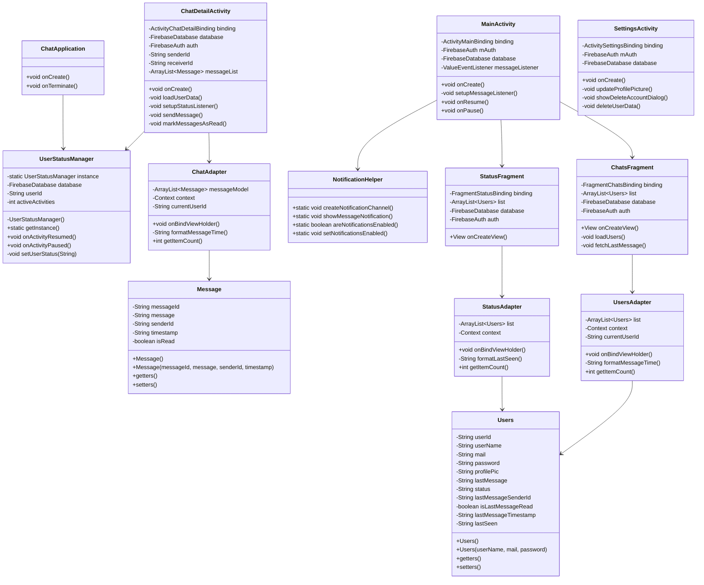

# Dokumentacja

## Diagram Klas


## Przegląd
Politechnika Chat to aplikacja do komunikacji w czasie rzeczywistym zbudowana na platformę Android z wykorzystaniem Firebase jako backendu. Aplikacja oferuje funkcje takie jak komunikacja natychmiastowa, śledzenie statusu online/offline, potwierdzenia odczytu i powiadomienia push.

## Stack Technologiczny
- **Platforma**: Android
- **Język**: Java
- **Backend**: Firebase Realtime Database
- **Uwierzytelnianie**: Firebase Authentication
- **Minimalne SDK**: Android 5.0 (API level 21)
- **Docelowe SDK**: Android 13 (API level 33)

## Główne Funkcje
1. Komunikacja w czasie rzeczywistym
2. Uwierzytelnianie użytkowników (email/nazwa użytkownika i hasło)
3. Śledzenie statusu online/offline
4. Potwierdzenia odczytu
5. Powiadomienia push
6. Zarządzanie profilem użytkownika
7. Znaczniki czasu ostatniej aktywności
8. Znaczniki czasu wiadomości
9. Usuwanie konta

## Komponenty Architektury

### Aktywności

#### 1. SignInActivity (Logowanie)
- Obsługa uwierzytelniania użytkowników
- Obsługuje:
  - Logowanie przez email lub nazwę użytkownika
  - Walidację hasła
  - Automatyczne logowanie dla istniejących sesji
  - Przejście do rejestracji

#### 2. SignUpActivity (Rejestracja)
- Zarządza rejestracją nowych użytkowników
- Funkcje:
  - Walidacja nazwy użytkownika
  - Walidacja emaila
  - Walidacja hasła
  - Automatyczne tworzenie profilu w Firebase

#### 3. MainActivity (Ekran Główny)
- Główny hub aplikacji
- Funkcje:
  - ViewPager z zakładkami Czaty i Status
  - Zarządzanie statusem użytkownika
  - Obsługa powiadomień
  - Przejście do ustawień
  - Funkcja wylogowania

#### 4. ChatDetailActivity (Szczegóły Czatu)
- Obsługuje indywidualne konwersacje
- Funkcje:
  - Wymiana wiadomości w czasie rzeczywistym
  - Wskaźniki statusu wiadomości
  - Status użytkownika online/offline
  - Potwierdzenia odczytu
  - Znaczniki czasu wiadomości
  - Informacja o ostatniej aktywności

#### 5. SettingsActivity (Ustawienia)
- Zarządza preferencjami użytkownika i ustawieniami konta
- Funkcje:
  - Zarządzanie zdjęciem profilowym
  - Ustawienia powiadomień
  - Usuwanie konta
  - Potwierdzenie hasłem dla wrażliwych operacji

### Fragmenty

#### 1. ChatsFragment (Fragment Czatów)
- Wyświetla listę konwersacji
- Funkcje:
  - Aktualizacje w czasie rzeczywistym
  - Podgląd ostatniej wiadomości
  - Znaczniki czasu wiadomości
  - Wskaźniki nieprzeczytanych wiadomości
  - Status online użytkownika

#### 2. StatusFragment (Fragment Statusów)
- Pokazuje status online/offline wszystkich użytkowników
- Funkcje:
  - Aktualizacje statusu w czasie rzeczywistym
  - Informacja o ostatniej aktywności
  - Awatary użytkowników

### Adaptery

#### 1. ChatAdapter
- Zarządza wyświetlaniem wiadomości czatu
- Funkcje:
  - Różne układy dla wysłanych/otrzymanych wiadomości
  - Znaczniki czasu
  - Wskaźniki odczytu

#### 2. UsersAdapter
- Obsługuje wyświetlanie listy użytkowników w czatach
- Funkcje:
  - Wyświetlanie awatarów
  - Wskaźniki statusu online
  - Podgląd ostatniej wiadomości
  - Formatowanie znaczników czasu

#### 3. StatusAdapter
- Zarządza wyświetlaniem statusów użytkowników
- Funkcje:
  - Wskaźniki online/offline
  - Informacje o ostatniej aktywności
  - Wyświetlanie zdjęć profilowych

### Narzędzia

#### 1. UserStatusManager
- Klasa singleton zarządzająca statusem użytkownika online/offline
- Funkcje:
  - Śledzenie cyklu życia aktywności
  - Aktualizacje statusu w czasie rzeczywistym
  - Zarządzanie znacznikami czasu ostatniej aktywności

#### 2. NotificationHelper
- Obsługuje powiadomienia push
- Funkcje:
  - Tworzenie kanału powiadomień
  - Powiadomienia o wiadomościach
  - Preferencje powiadomień
  - Obsługa kliknięć

### Modele

#### 1. Message (Wiadomość)
- Model danych dla wiadomości czatu
- Właściwości:
  - messageId: Unikalny identyfikator
  - message: Treść wiadomości
  - senderId: ID nadawcy
  - timestamp: Czas wiadomości
  - isRead: Status odczytu

#### 2. Users (Użytkownicy)
- Model danych dla informacji o użytkowniku
- Właściwości:
  - userId: Unikalny identyfikator
  - userName: Nazwa wyświetlana
  - mail: Adres email
  - profilePic: URL awatara
  - status: Status online/offline
  - lastSeen: Znacznik czasu ostatniej aktywności

## Struktura Firebase

### Schemat Bazy Danych
```
|-- Users
|   |-- userId
|       |-- userName
|       |-- mail
|       |-- profilePic
|       |-- status
|       |-- lastSeen
|
|-- chats
    |-- senderIdReceiverId
        |-- messageId
            |-- message
            |-- senderId
            |-- timestamp
            |-- isRead
```

## Funkcje Bezpieczeństwa
1. Uwierzytelnianie poprzez Firebase Auth
2. Potwierdzenie hasłem dla wrażliwych operacji
3. Automatyczne zarządzanie sesją
4. Bezpieczna struktura danych
5. Reguły bazy danych w czasie rzeczywistym

## Optymalizacje Wydajności
1. Grupowanie wiadomości
2. Wydajne aktualizacje adapterów
3. Optymalizacja ładowania obrazów z Picasso
4. Implementacja wzorca ViewHolder
5. Opóźnione aktualizacje statusu

## Obsługa Błędów
1. Zarządzanie błędami sieci
2. Obsługa błędów uwierzytelniania
3. Obsługa błędów operacji bazodanowych
4. Zapasowe ładowanie obrazów
5. Płynna degradacja funkcjonalności

## Funkcje Interfejsu Użytkownika
1. Implementacja Material Design 3
2. Płynne animacje
3. Aktualizacje w czasie rzeczywistym
4. Intuicyjna nawigacja
5. Wyraźne wskaźniki statusu
6. Kompleksowe znaczniki czasu
7. Przyjazne komunikaty błędów

## Plany Rozwoju
1. Implementacja czatów grupowych
2. Możliwość udostępniania mediów
3. Szyfrowanie wiadomości
4. Połączenia głosowe/wideo
5. Funkcja wyszukiwania wiadomości
6. Kopia zapasowa/przywracanie wiadomości
7. Wsparcie dla trybu ciemnego
8. Wsparcie dla wielu języków
